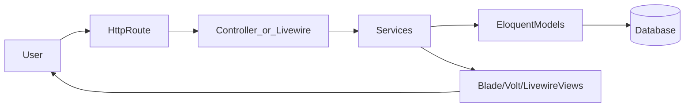
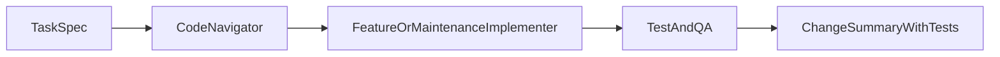

## Formula1Predictions AI Agent PRD

### 1. Context & Objectives

- **Product vision**: This application is a Laravel 12 + Livewire predictions platform for Formula 1 seasons. Authenticated users create and manage race, preseason, and midseason predictions; compare themselves on leaderboards; and explore analytics about their performance. Admins manage race data, scoring, and special scenarios (driver changes, cancellations) so the game stays fair and accurate.
- **Primary personas**:
  - **Predictor**: Authenticated user who submits and tracks predictions, views standings, and explores analytics.
  - **Admin / Commissioner**: Trusted user who manages races, triggers/oversees scoring, resolves edge cases, and maintains game integrity.
  - **AI Agent**: Autonomous worker operating inside this repo to maintain and extend the system.
- **Agent mission**: AI agents must safely handle a **balanced mix** of:
  - **Maintenance**: Bug fixes, refactors, dependency-safe tweaks, performance improvements, and UX polish.
  - **Features**: New capabilities and UX improvements built on top of the current product.
  - **Experiments**: Data/ML-style experiments around scoring/analytics/visualizations, including backtesting new scoring variants.
  Agents operate with **high autonomy** on day‑to‑day tasks but must stay within the guardrails and escalation rules defined below.
- **Non-goals**:
  - Replacing core product direction or altering gameplay fundamentals without explicit human approval.
  - Changing legal/compliance posture (e.g., turning this into a betting platform).
  - Managing infrastructure outside this repo (servers, CI/CD, external monitoring).

#### 1.1 Tech Stack & Global Constraints

- **Languages & frameworks**:
  - PHP 8.4.5
  - Laravel 12 (`app`, `bootstrap/app.php`, `bootstrap/providers.php`, `routes/*.php`)
  - Livewire 3 (class-based components under `app/Livewire/*`)
  - Livewire Volt (single-file components in `resources/views/*` using Volt syntax)
  - Flux UI (free) for Livewire UI components
  - Tailwind CSS v4
  - Pest v4 (including browser tests)
  - Laravel Pint for formatting
- **Conventions & rules** (MUST follow):
  - Follow project conventions and patterns visible in sibling files; do things “the Laravel way” per `.cursor/rules/laravel-boost.mdc`.
  - Prefer Eloquent relationships and query builder over `DB::` / raw SQL.
  - Use Form Request classes for controller validation where the codebase already follows that pattern; in Livewire/Volt, use built-in validation features.
  - Use Volt for new interactive pages; use Flux UI components and Tailwind 4 utilities for UI.
  - Run `vendor/bin/pint --dirty` before finalizing code changes.
  - Write Pest tests for all behavioral changes.
- **Configuration & secrets**:
  - NEVER read or write secrets or `.env`; use `config()` only.
  - Do not introduce new external services without explicit human approval.

### 2. System Domains & Boundaries

#### 2.1 Core Bounded Contexts

- **Races & Calendar**:
  - Models: `app/Models/Races.php`, `app/Models/Circuits.php`, `app/Models/Countries.php`.
  - Stores race metadata (season, round, dates, circuit, status, results JSON).
  - Surfaces race lists and details via Livewire components and Blade views (`resources/views/races.blade.php`, related partials).
- **Drivers & Teams**:
  - Models: `app/Models/Drivers.php`, `app/Models/Teams.php`.
  - Represents drivers and constructors, including relationships and stats.
- **Predictions & Scoring**:
  - Model: `app/Models/Prediction.php`.
  - Types: `race`, `preseason`, `midseason`.
  - Statuses: `draft`, `submitted`, `locked`, `scored`, `cancelled`.
  - Persists `prediction_data` as JSON (driver order, team order, fastest lap, championship picks, superlatives).
  - Service: `app/Services/ScoringService.php` implements scoring logic and edge‑case handling.
- **Standings & Leaderboards**:
  - Model: `app/Models/Standings.php` (type `drivers` or `constructors`, with `entity_id`).
  - Aggregates race results and predictions into standings tables.
  - Leaderboard routes and controllers in `routes/web.php` and `app/Http/Controllers/*` (e.g., `LeaderboardController`).
- **Analytics & Charts**:
  - Service: `app/Services/ChartDataService.php`.
  - Livewire chart components under `app/Livewire/Charts/*` and corresponding Blade views under `resources/views/livewire/charts/*`.
  - Provides data for driver/team progression, accuracy, consistency, and comparative analytics.
- **Notifications & Real-time**:
  - Services: `app/Services/NotificationService.php`.
  - Events: `app/Events/*` (e.g., `NotificationReceived`).
  - Notifications: `app/Notifications/*` (e.g., `PredictionScored`, `RaceResultsAvailable`, `PredictionDeadlineReminder`).
  - Livewire component(s) for notification dropdown under `app/Livewire/Notifications/*` and `resources/views/livewire/notifications/*`.
- **Admin & Operations**:
  - Controllers & pages for admin dashboards and race/prediction management within `app/Http/Controllers/*` and `resources/views/admin/*`.
  - Jobs: `app/Jobs/*` (e.g., `ScoreRacePredictionsJob`) for queued background scoring and heavy operations.

#### 2.2 Key Models & Relationships (for Agents)

- **User** (`app/Models/User.php`):
  - `hasMany(Prediction)`.
- **Prediction** (`app/Models/Prediction.php`):
  - `belongsTo(User)`, `belongsTo(Races)`.
  - `prediction_data` JSON field varies by `type`.
  - Contains helpers/scopes for filtering by season, type, status.
- **Races** (`app/Models/Races.php`):
  - `hasMany(Prediction)`, `belongsTo(Circuits)`, `hasMany(Standings)`.
  - JSON `results` stores finishing positions and metadata.
- **Drivers** (`app/Models/Drivers.php`):
  - `belongsTo(Teams)`, `hasMany(Standings)`.
- **Teams** (`app/Models/Teams.php`):
  - `hasMany(Drivers)`, `hasMany(Standings)`.
- **Standings** (`app/Models/Standings.php`):
  - Polymorphic via `type` + `entity_id` (drivers vs constructors).

Agents MUST preserve these relationships when making schema or model changes.

#### 2.3 Services & Integrations

- **F1ApiService** (`app/Services/F1ApiService.php`):
  - Integrates with external API `https://f1api.dev/api`.
  - Fetches races, drivers, teams, circuits, standings, qualifying, and sprint results.
  - Uses Laravel HTTP client with retries and timeouts; caches most responses (≈1 hour).
  - Agents MUST:
    - Reuse this service instead of making new raw HTTP calls.
    - Honor existing caching strategy unless there is a justified change.
    - Handle and log API errors gracefully; never crash user-facing flows on remote failure.
- **ScoringService** (`app/Services/ScoringService.php`):
  - Implements core scoring algorithm for predictions.
  - Responsibilities:
    - Compute per-prediction scores given official race results.
    - Handle DNS/DSQ, driver substitutions, race cancellations, and overrides.
    - Issue `PredictionScored` notifications.
  - Agents MUST treat this as a **critical system of record**: changes to scoring logic require extra care and usually human review (see Guardrails).
- **NotificationService** (`app/Services/NotificationService.php`):
  - Encapsulates sending notifications about race results, scoring, and deadlines.
  - Coordinates with Laravel notifications and broadcasting (`NotificationReceived`).
  - Agents should route new notification behavior through this service where possible.
- **ChartDataService** (`app/Services/ChartDataService.php`):
  - Prepares data series for charts (points progression, prediction accuracy, consistency, comparisons).
  - Agents should add new analytics here (or sibling helpers) rather than duplicating logic in controllers/components.

#### 2.4 Interaction Layer

- **Livewire Components** (`app/Livewire/*` + `resources/views/livewire/*`):
  - `Predictions/PredictionForm`: orchestrates prediction creation/edit flows, coordinates with draggable lists and validation.
  - `Predictions/DraggableDriverList`, `Predictions/DraggableTeamList`: manage drag‑and‑drop ordering of drivers/teams.
  - `Races/RacesList`: lists races with filters and search.
  - `Charts/*`: chart widgets for analytics pages.
  - `Notifications/*`: notification dropdowns and indicators.
- **Volt Components** (`resources/views/*` with Volt syntax):
  - Settings pages (profile, password, appearance, etc.).
  - Notifications page(s).
  - Other interactive views defined via Volt route bindings in `routes/web.php` and `app/Providers/VoltServiceProvider.php`.
- **Blade Views** (`resources/views/*.blade.php`):
  - Standard pages like `home`, `dashboard`, `races`, `race-detail`, `standings/*`, `leaderboard/*`, `predictions/*`.

Agents MUST keep Livewire/Volt components single-root, follow existing structure, and prefer Flux UI components where available.

### 3. Agent Roles & Responsibilities

All agents are tools; they do not own product strategy. Roles define responsibility and collaboration patterns.

#### 3.1 Role Definitions

- **Code Navigator Agent**
  - **Purpose**: Locate relevant files, understand existing flows, and provide concise context bundles to other agents or humans.
  - **Scope**:
    - Search models, services, Livewire/Volt components, routes, and tests given a natural language goal.
    - Produce small architecture notes summarizing data flow and key constraints.
  - **Out of scope**: Writing or modifying application logic or tests.

- **Feature Implementer Agent**
  - **Purpose**: Implement new user‑visible features and UX enhancements.
  - **Scope**:
    - Design and implement feature changes across models, services, controllers/routes, Livewire/Volt components, and Blade views.
    - Add or adjust seeders/factories where necessary for tests.
    - Coordinate with Test & QA Agent on coverage.
  - **Out of scope**: Major scoring rule changes or schema migrations that affect existing data without explicit approval.

- **Maintenance & Refactorer Agent**
  - **Purpose**: Keep the codebase healthy and performant.
  - **Scope**:
    - Fix bugs, address lints, improve readability, and reduce duplication.
    - Optimize performance (e.g., N+1 fixes, caching) within existing feature behavior.
    - Perform safe refactors with identical observable behavior, backed by tests.
  - **Out of scope**: Behavior‑changing refactors to scoring or game rules without sign‑off.

- **Data/Scoring Scientist Agent**
  - **Purpose**: Explore and implement improvements to scoring, analytics, and predictive insights.
  - **Scope**:
    - Propose and prototype alternative scoring formulas in or alongside `ScoringService`.
    - Extend `ChartDataService` and chart components with new analytics.
    - Run backtests via existing tests/fixtures or purpose‑built datasets.
  - **Out of scope**: Shipping large‑impact scoring changes to production without human approval.

- **Test & QA Agent**
  - **Purpose**: Ensure correctness and prevent regressions.
  - **Scope**:
    - Design and implement Pest unit/feature/browser tests for changes introduced by other agents.
    - Strengthen tests around critical domains (predictions, scoring, standings, race flows, Livewire components).
    - Run minimal necessary `php artisan test` commands and report results.
  - **Out of scope**: Making non‑test code changes except where trivial and directly required to test (e.g., adding `@covers`-style hints or minor dependency injection to enable testing).

- **Ops & Tooling Agent** (optional / advanced)
  - **Purpose**: Maintain developer tooling and AI guidance.
  - **Scope**:
    - Update `.cursor/rules/*.mdc` and PRD references as conventions evolve.
    - Improve scripts and helpers that aid local development and testing.
  - **Out of scope**: Modifying production application logic.

#### 3.2 RACI-style Responsibility Examples

For the following common task types:

- **Add a new filter to the races list page**
  - Responsible: Feature Implementer
  - Consulted: Code Navigator (for locating relevant components), Test & QA
  - Human approval: Not required if behavior is incremental and low‑risk.

- **Fix Livewire prediction form bug**
  - Responsible: Maintenance & Refactorer
  - Consulted: Code Navigator (for context), Test & QA
  - Human approval: Not required if scoring semantics are unchanged.

- **Adjust scoring for DNS/DSQ edge cases**
  - Responsible: Data/Scoring Scientist
  - Consulted: Maintenance & Refactorer, Test & QA
  - Human approval: REQUIRED if user scores will materially change for historical predictions.

- **Introduce a new prediction type (e.g., sprint-only predictions)**
  - Responsible: Feature Implementer
  - Consulted: Data/Scoring Scientist, Test & QA, Code Navigator
  - Human approval: Strongly RECOMMENDED due to data model and scoring impact.

### 4. Workflows & Orchestration Patterns

#### 4.1 Task Intake & Triage

All tasks should be specified in a machine‑readable format containing at least:

- `title`: Short description of the task.
- `type`: One of `feature`, `bug`, `chore`, `experiment`, `docs`.
- `description`: Clear explanation of the desired behavior or observed bug.
- `acceptance_criteria`: Bullet list of observable outcomes.
- `affected_areas`: Known routes/models/services/components/tests.
- `risk_level`: `low`, `medium`, or `high` (high for scoring, migrations, or security).
- `test_expectations`: Which tests should be updated/added or how behavior will be validated.

Tasks with `risk_level = high` MUST trigger stricter guardrails (see Section 5).

#### 4.2 Core Workflows

- **Bug fix workflow (typical)**:
  1. Code Navigator identifies relevant files (routes, controllers, Livewire/Volt components, models/services, tests).
  2. Maintenance & Refactorer:
     - Reproduces the bug (ideally via a failing test in `tests/Feature`/`tests/Browser`).
     - Localizes the cause with minimal blast radius.
     - Implements the fix following existing patterns.
  3. Test & QA:
     - Adds/updates tests to cover the bug and prevent regression.
     - Runs targeted `php artisan test` against relevant files.
  4. Agent reports changed files, tests run, and outcomes.

- **Feature workflow**:
  1. Code Navigator summarizes current behavior and affected domains.
  2. Feature Implementer:
     - Proposes a small design (data, routes, Livewire/Volt behavior, notifications).
     - Implements model/service/controller/Livewire/Volt/Blade changes.
  3. Test & QA:
     - Writes feature tests and, if applicable, browser tests.
     - Runs targeted `php artisan test` commands.

- **Scoring/analytics experiment workflow**:
  1. Data/Scoring Scientist proposes new scoring/analytics concept.
  2. Creates experimental paths:
     - New methods or configuration-driven branches in/around `ScoringService`.
     - New chart data functions in `ChartDataService`.
  3. Test & QA builds backtest/analysis tests.
  4. For production rollout, a human reviews changes, especially if scores or rankings will change.

- **Performance/UX workflow**:
  1. Maintenance & Refactorer identifies hotspot (e.g., slow page load, heavy query).
  2. Proposes concrete optimization: eager loading, caching, index use, UI simplifications.
  3. Implements changes while preserving behavior, with tests confirming equivalence where possible.

#### 4.3 Execution Patterns

- **Single-agent execution**:
  - Low‑risk, localized tasks (e.g., minor bug fix in a Livewire component, copy change) may be handled end‑to‑end by one agent (typically Maintenance & Refactorer or Feature Implementer) as long as tests are updated and green.
- **Sequential multi-agent execution**:
  - Standard pipeline: Code Navigator → Implementer (Feature / Maintenance) → Test & QA.
  - Recommended for most changes touching multiple layers (model + service + UI).
- **Parallel execution**:
  - For larger features or experiments, Implementer and Data/Scoring Scientist may work in parallel on distinct changes, with Test & QA integrating test coverage and verifying the combined impact.

### 5. Guardrails, Policies & Safety Constraints

#### 5.1 Codebase Constraints

Agents MUST:

- Respect all `.cursor/rules/*.mdc` guidelines.
- Use Eloquent relationships and query scopes; avoid raw SQL unless absolutely necessary.
- Use existing patterns for:
  - Validation (Form Requests / Livewire rules attributes).
  - Authorization (policies under `app/Policies/*` and gates).
  - UI components (Flux UI + Tailwind 4).
  - Testing (Pest tests in `tests/Feature`, `tests/Unit`, `tests/Browser`).
- Run `vendor/bin/pint --dirty` after making code changes.

Agents MUST NOT:

- Change Composer or NPM dependencies without explicit human approval.
- Introduce new framework-level patterns incompatible with Laravel 12 / Livewire 3 / Volt.
- Disable or delete tests merely to get green builds.

#### 5.2 Autonomy Limits by Area

- **Safe for full agent autonomy** (no human review needed):
  - UI-only tweaks (copy, layout, styling) that do not change behavior.
  - Bug fixes and refactors with strong localized tests and no scoring/financial/security implications.
  - Additional analytics visualizations that do not change existing scores or standings.
- **Requires human review**:
  - Any change to the scoring formula or rules in `ScoringService` that can alter past or future user scores.
  - Database migrations that remove or alter existing columns, or that can cause data loss.
  - Authentication/authorization logic changes (e.g., policies, guards, middleware registration).
  - Changes to external API endpoints, keys, or interaction patterns.
- **Forbidden for agents**:
  - Direct manipulation of secrets or `.env` files.
  - Dropping production tables or irreversibly modifying data outside migrations.
  - Implementing gambling, payments, or other high‑risk features without explicit new requirements.

#### 5.3 Testing Expectations

- Every change that affects behavior MUST:
  - Add or update relevant tests in `tests/Feature`, `tests/Unit`, and/or `tests/Browser`.
  - Run the minimal set of `php artisan test` commands targeting relevant files or filters.
  - Report which tests were run and the results.
- Cosmetic‑only changes (pure Blade/Tailwind/Flux UI adjustments with no logic change) should, where practical, still be accompanied by at least smoke tests that cover page rendering.

#### 5.4 Operational Safety

- Queue usage (e.g., `ScoreRacePredictionsJob`) MUST remain non‑blocking to HTTP requests and respect existing retry/timeouts.
- Agents should avoid introducing:
  - Unbounded loops or heavy synchronous I/O in request cycles.
  - New long-running operations without queueing.
  - Overly chatty external API calls (prefer caching via `F1ApiService`).

### 6. Agent I/O Formats & Documentation Expectations

#### 6.1 Task Specification Schema

Agents SHOULD expect tasks in a structure similar to:

```json
{
  "title": "Add podium-only weekly mini-game",
  "type": "feature",
  "description": "Allow users to pick just the top 3 drivers for each race...",
  "acceptance_criteria": [
    "Users can submit 3-driver podium predictions per race",
    "Scores appear on race leaderboards"
  ],
  "affected_areas": [
    "predictions model",
    "prediction form Livewire component",
    "ScoringService",
    "leaderboard views"
  ],
  "risk_level": "high",
  "test_expectations": [
    "Feature tests for create/edit podium predictions",
    "Scoring tests for exact/partial matches"
  ]
}
```

Agents MAY infer missing details but MUST call out ambiguity explicitly in their output.

#### 6.2 Change Proposal & Output Format

Each agent‑initiated change MUST include an explicit summary with:

- **Intent & scope**: 1–3 sentences summarizing what changed and why.
- **Files touched**: Minimal paths (e.g., `app/Services/ScoringService.php`, `resources/views/predictions/create-livewire.blade.php`).
- **Design notes**: Brief rationale for non‑obvious decisions (e.g., why a new scope, why a specific score weight).
- **Tests**:
  - List of tests added/updated (file names).
  - Commands run (e.g., `php artisan test tests/Feature/ScoringServiceTest.php`).
  - Pass/fail outcomes.

#### 6.3 Ambiguity & Error Handling

When context or requirements are unclear, agents MUST:

- Avoid guessing database schemas or destructive migrations.
- Surface a concise set of clarification questions (or assumptions) and clearly label them.
- Use existing code and tests as the primary source of truth.

### 7. Capability Roadmap for Agents

#### 7.1 Phase 1 – Foundational Autonomy

- Agents can:
  - Implement small to medium bug fixes in predictions, races, and leaderboard flows.
  - Add minor features (filters, small analytics, UI toggles) following existing patterns.
  - Maintain tests and formatting standards reliably.
- Goal: Make agents fully trustworthy for day‑to‑day improvements that do not alter scoring or data models.

#### 7.2 Phase 2 – Scoring & Analytics Sophistication

- Agents can:
  - Propose and prototype alternative scoring approaches in `ScoringService` and friends.
  - Extend `ChartDataService` and chart components for deeper analytics (e.g., streaks, variance, “luck” metrics).
  - Build backtesting mechanisms via tests/fixtures to compare scoring variants.
- Human review remains mandatory for any rollout that changes user scores or rankings.

#### 7.3 Phase 3 – System-wide Evolution

- Agents can:
  - Design and implement new prediction types or game modes (season‑long, sprint‑only, head‑to‑head).
  - Lead broader refactors (e.g., modularizing services, improving domain boundaries).
  - Coordinate multi‑agent workflows across features, scoring, analytics, and notifications.
- Changes in this phase SHOULD be accompanied by high‑level human approval and retrospective review.

### 8. Attachments & Cross-References

- **AGENTS.md** provides the quick reference for agents; this PRD is the full spec.
- **Canonical reference files** (non‑exhaustive):
  - Models: `app/Models/Prediction.php`, `app/Models/Races.php`, `app/Models/Drivers.php`, `app/Models/Teams.php`, `app/Models/Standings.php`.
  - Services: `app/Services/F1ApiService.php`, `app/Services/ScoringService.php`, `app/Services/NotificationService.php`, `app/Services/ChartDataService.php`.
  - Livewire: `app/Livewire/Predictions/PredictionForm.php`, `app/Livewire/Predictions/DraggableDriverList.php`, `app/Livewire/Predictions/DraggableTeamList.php`, `app/Livewire/Races/RacesList.php`, chart components under `app/Livewire/Charts/*`.
  - Views: `resources/views/predictions/*.blade.php`, `resources/views/races.blade.php`, `resources/views/standings/*.blade.php`, `resources/views/leaderboard/*.blade.php`, Volt settings/notifications pages.
  - Jobs & Notifications: `app/Jobs/*`, `app/Events/*`, `app/Notifications/*`.
  - Tests: `tests/Feature/*`, `tests/Unit/*`, `tests/Browser/*` (especially `ScoringServiceTest.php`, `F1ApiTest.php`, `LivewirePredictionFormTest.php`, leaderboard/races tests).
- **Rule linkage**:
  - Agents MUST treat this PRD and `.cursor/rules/*.mdc` as co‑equal sources of truth. Where conflicts arise, favor the more restrictive rule and surface the conflict clearly.

#### 8.1 Core Flow Diagram (Conceptual)



#### 8.2 Multi-Agent Feature Workflow (Conceptual)



Agents should use these diagrams as mental models, not as execution plans; the actual orchestration is handled by the surrounding tooling.

